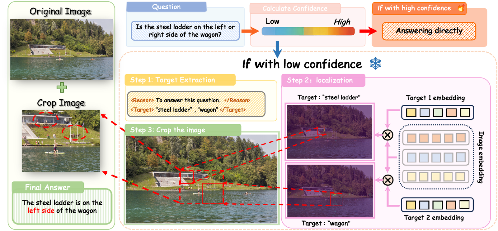
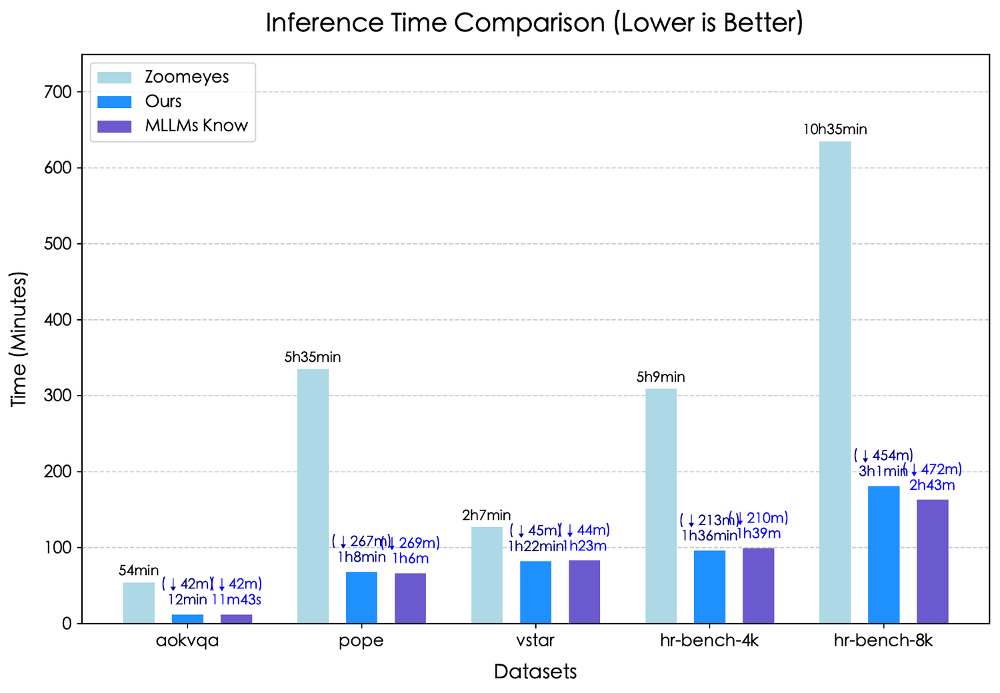

<div align="center">

<h1 align="center">
   LookWise
</h1>

### Knowing When and Where to Look for Fine-Grained Visual Reasoning in Multimodal Large Language Models

[](https://arxiv.org/abs/2603.00171)
[](https://www.python.org/)
[](#method)
[](#main-results)

**LookWise lets MLLMs decide when to look more carefully and where to look.**

[Paper](https://arxiv.org/abs/2603.00171) | [Method](#method) | [Results](#main-results) | [Installation](#installation) | [Citation](#citation)

</div>

## Overview

LookWise is a training-free inference framework for fine-grained visual reasoning in multimodal large language models. Instead of applying extra visual processing to every query, it first estimates **when** the model needs more local evidence from answer confidence, then determines **where** to inspect by grounding question-relevant targets with semantic-guided localization. The selected regions are reintroduced as focused visual context, improving small-object, attribute, and spatial reasoning without additional training.

<table>
  <tr>
    <td><b>Training-free</b><br>Works at inference time without parameter updates or task-specific fine-tuning.</td>
    <td><b>When-aware</b><br>Uses confidence to decide whether a query needs focused visual inspection.</td>
  </tr>
  <tr>
    <td><b>Where-aware</b><br>Localizes question-relevant visual targets before constructing zoomed context.</td>
    <td><b>Efficient</b><br>Avoids exhaustive search while keeping high-resolution reasoning practical.</td>
  </tr>
</table>

## Method

LookWise follows a two-stage inference pipeline. The confidence module answers **when to look**, while semantic-guided localization answers **where to look**. Together, they reduce redundant cropping and help the model focus on fine-grained evidence.

<p align="center">
  
</p>

## Main Results

LookWise improves strong open-source MLLM baselines on both general reasoning and high-resolution visual reasoning benchmarks. The gains are especially clear on V*-Bench and HR-Bench, where small objects, subtle attributes, and spatial relations require more precise visual evidence.

### Performance Snapshot

| Backbone | Benchmark | Baseline | LookWise | Gain |
| :--- | :--- | ---: | ---: | ---: |
| LLaVA-v1.5-7B | AOKVQA | 71.00 | 72.90 | +1.90 |
| LLaVA-v1.5-7B | POPE | 86.98 | 87.37 | +0.39 |
| LLaVA-v1.5-7B | V*-Bench | 48.68 | 62.80 | +14.12 |
| LLaVA-v1.5-7B | HR-Bench 4K | 36.13 | 47.38 | +11.25 |
| LLaVA-v1.5-7B | HR-Bench 8K | 32.13 | 42.00 | +9.87 |
| Qwen2.5-VL-3B | AOKVQA | 71.44 | 73.10 | +1.66 |
| Qwen2.5-VL-3B | POPE | 87.20 | 89.12 | +1.92 |
| Qwen2.5-VL-3B | V*-Bench | 75.90 | 86.38 | +10.48 |
| Qwen2.5-VL-3B | HR-Bench 4K | 67.50 | 73.25 | +5.75 |
| Qwen2.5-VL-3B | HR-Bench 8K | 58.88 | 70.00 | +11.12 |

### Efficiency

LookWise avoids exhaustive image search and keeps inference close to lightweight attention-based methods, while substantially reducing runtime compared with ZoomEye on high-resolution benchmarks.

<p align="center">
  
</p>

<details>
<summary><b>Full benchmark table</b></summary>

Results are reported on AOKVQA, POPE, V*-Bench, HR-Bench 4K, and HR-Bench 8K. Higher is better.

| Model | Method | Training-free | AOKVQA | POPE | V*-Bench | HR-Bench 4K | HR-Bench 8K |
| :--- | :--- | :---: | ---: | ---: | ---: | ---: | ---: |
| LLaVA-v1.5-7B | Baseline | yes | 71.00 | 86.98 | 48.68 | 36.13 | 32.13 |
| LLaVA-v1.5-7B | DC2 | yes | - | - | 57.60 | - | 39.50 |
| LLaVA-v1.5-7B | VisCrop | yes | - | - | 62.30 | 46.25 | 35.75 |
| LLaVA-v1.5-7B | MLLMs-Know | yes | 72.31 | 87.25 | 56.02 | 44.38 | 37.25 |
| LLaVA-v1.5-7B | ZoomEye | yes | 70.56 | **88.94** | **83.25** | **49.88** | **48.63** |
| LLaVA-v1.5-7B | **LookWise** | yes | **72.90** | 87.37 | 62.80 | 47.38 | 42.00 |
| LLaVA-v1.5-7B | Delta vs. baseline | - | +1.90 | +0.39 | +14.12 | +11.25 | +9.87 |
| Qwen2.5-VL-3B | Baseline | yes | 71.44 | 87.20 | 75.90 | 67.50 | 58.88 |
| Qwen2.5-VL-3B | Pixel Reasoner | no | - | - | 84.82 | - | 66.00 |
| Qwen2.5-VL-3B | MLLMs-Know | yes | 71.62 | **89.12** | 75.90 | 66.36 | 64.88 |
| Qwen2.5-VL-3B | ZoomEye | yes | 71.26 | 88.93 | **89.01** | 70.13 | 68.38 |
| Qwen2.5-VL-3B | **LookWise** | yes | **73.10** | **89.12** | 86.38 | **73.25** | **70.00** |
| Qwen2.5-VL-3B | Delta vs. baseline | - | +1.66 | +1.92 | +10.48 | +5.75 | +11.12 |

</details>

## Installation

```bash
git clone https://github.com/Xiaoxiang100/LookWise.git
cd LookWise
pip install -r requirements.txt
```

## Data And Models

Set the model and annotation roots before running evaluation:

```bash
export MODEL_PATH=/path/to/Qwen2.5-VL-3B-Instruct
export ANNO_PATH=/path/to/lookwise_data
```

Expected annotation layout:

```text
lookwise_data/
  hr-bench_4k/annotation_hr-bench_4k.json
  hr-bench_8k/annotation_hr-bench_8k.json
```

## Evaluation

Run LookWise:

```bash
bash run_lookwise_4k.sh
bash run_lookwise_8k.sh
```

Run the direct-answer baseline:

```bash
bash run_lookwise_4k.sh direct
bash run_lookwise_8k.sh direct
```

Use a custom confidence threshold:

```bash
CONF_THRESHOLD=0.96 bash run_lookwise_4k.sh
```

Score a merged HR-Bench answer file:

```bash
python lookwise/eval/eval_results_hr-bench.py --answers-file /path/to/result.jsonl
```

## Repository Layout

```text
LookWise/
  lookwise/
    pipeline.py                # Core method inference pipeline
    method.py                  # Base method interface
    qwen_vl_model.py           # Qwen2.5-VL method wrapper
    utils.py                   # Utility functions
    qwen2_5_methods.py         # Qwen-specific helpers
    eval/
      run_inference.py         # Evaluation inference entry point
      eval_results_hr-bench.py # HR-Bench scorer
    ic_examples/               # In-context examples
    llava/                     # LLaVA-derived components
  run_lookwise_4k.sh           # HR-Bench 4K runner
  run_lookwise_8k.sh           # HR-Bench 8K runner
  requirements.txt
```

## Citation

If LookWise helps your research, please cite:

```bibtex
@article{shen2026lookwise,
  title={LookWise: Knowing When and Where to Look for Fine-Grained Visual Reasoning in Multimodal Large Language Models},
  author={Shen, Yuxiang and Huang, Hailong and Gao, Zhenkun and Li, Xueheng and Zhou, Man and Xie, Chengjun and Che, Haoxuan and He, Xuanhua and Zhang, Jie},
  journal={arXiv preprint arXiv:2603.00171},
  year={2026}
}
```

## Contact

For questions, suggestions, or reproduction issues, please open an issue in this repository.
